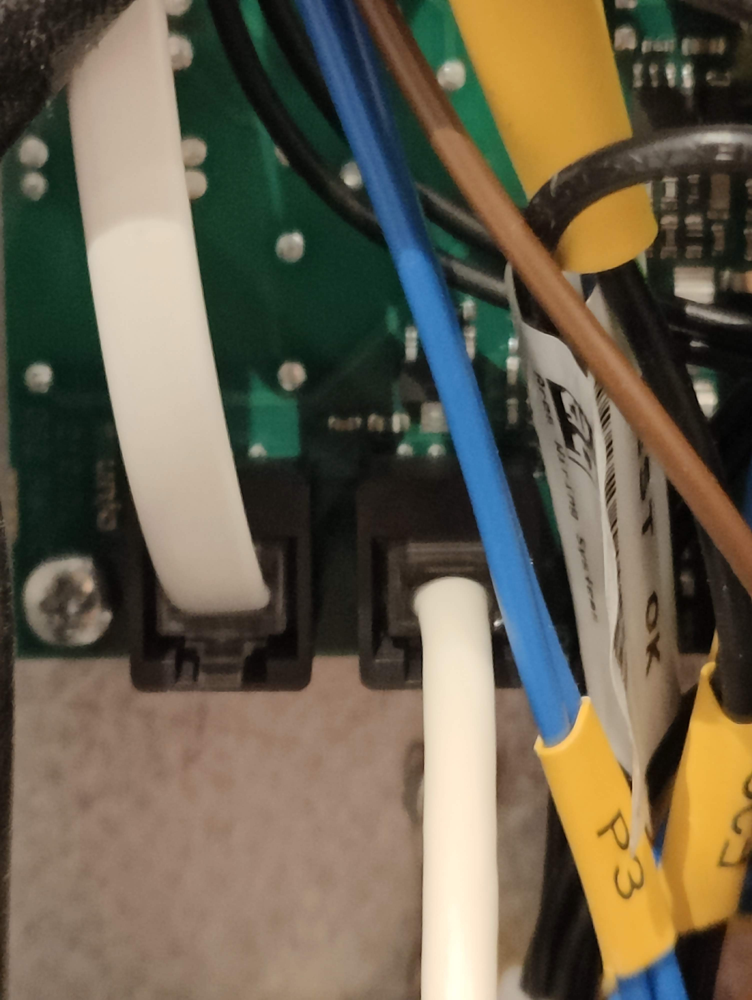
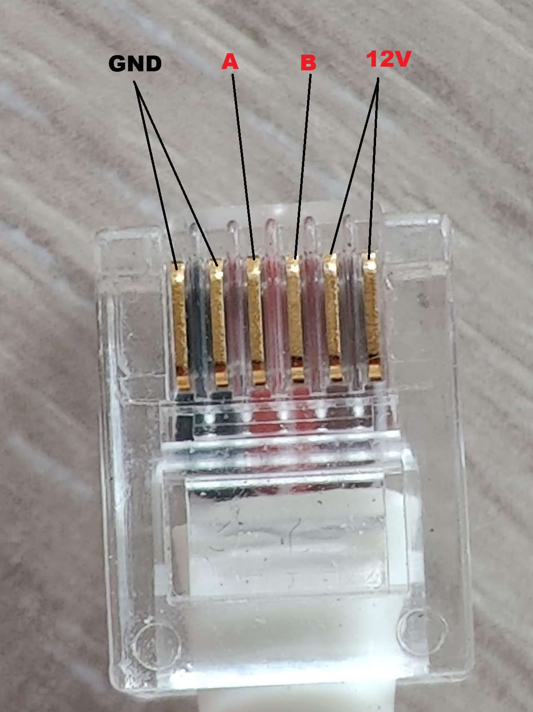
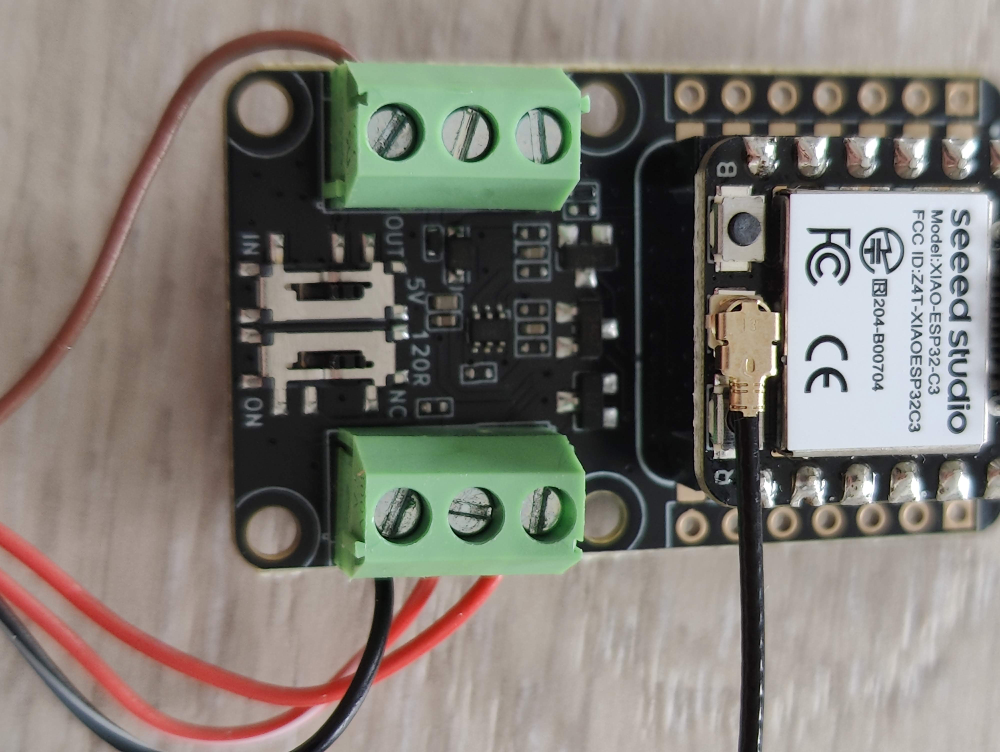
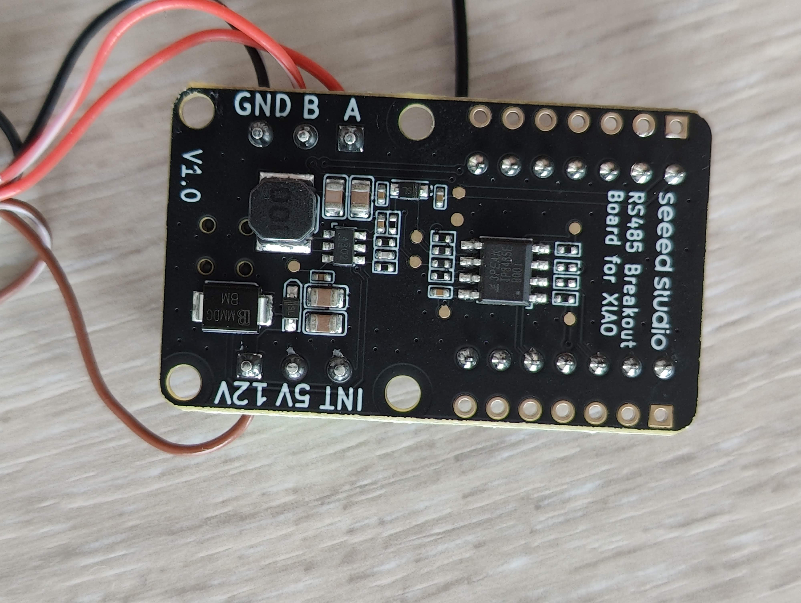

# Overview
The `XIAO-ESP32-C3` and `RS485 Breakout Board for Seeed Studio-XIAO` is easy to assemble and results in a small package. Buy the pre soldered header version to avoid soldering. 

## Links
[`XIAO-ESP32-C3` - Seeedstudio](https://www.seeedstudio.com/Seeed-XIAO-ESP32C3-p-5431.html)<br>
[`RS485 Breakout Board for Seeed Studio-XIAO` - Seeedstudio](https://www.seeedstudio.com/RS485-Breakout-Board-for-XIAO-p-6306.html)

## C(X)60

| C(X)60 connection header | RJ12 pinout |
|---|---|
| <a href="../assets/img/headers/connection-header-cx60.jpg"></a> | <a href="../assets/img/headers/rj12-pinout.png"></a> |

<sub>Click images to view full size.</sub>

## XIAO
| Front | Back |
|---|---|
| <a href="../assets/img/xiao-breakout-board/xiao-front.jpg"></a> | <a href="../assets/img/xiao-breakout-board/xiao-back.jpg"></a> |

<sub>Click images to view full size.</sub>

### DIP switches
- The DIP switch for IN/OUT needs to be configured based on your needs. Leave it in OUT if unsure. 
- The DIP switch for the 120Ω termination resistor can be left in NC.

## Config
Relevant part of config to configure the uart and flexit_modbus_server correctly
```yaml 
uart:
  id: modbus_uart
  tx_pin: GPIO6
  rx_pin: GPIO7
  baud_rate: 115200

flexit_modbus_server:
  - id: server
    uart_id: modbus_uart
    address: 3
    tx_enable_pin: GPIO4
    tx_enable_direct: true 
```